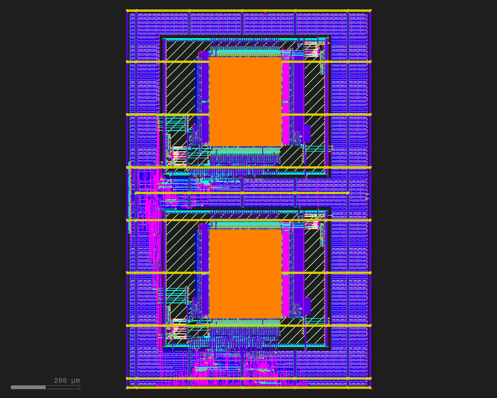

# Group 0
___
## Data Cache

The cache is a simple read-only data cache placed between the processor and an external backing memory connected through SPI. It is intended to reduce repeated external memory reads for recently accessed data while keeping the implementation small and easy to verify.

In the current configuration, the cache is used for cached reads only. CPU writes to the cached region are not propagated through the cache. External memory updates are performed through separate direct-access or Wishbone/SPI control paths.

### Cache Organization

The cache is implemented as a direct-mapped cache with 256 entries. Each entry stores one 32-bit word.

CPU addresses in the cached memory region use the range:

```text
0xe000_0000 - 0xefff_ffff
```

Internally, the cache strips the upper memory-map nibble and uses the lower 28 bits as the local address:
```text
localAddr = cpuAddr[27:0]
```

The address is divided as follows:
```text
offset = localAddr[1:0]
index  = localAddr[9:2]
tag    = localAddr[27:10]
```

Each cache entry has associated metadata containing a valid bit and a tag. A cache hit occurs when the selected entry is valid and its stored tag matches the requested tag.

The backing address is generated from the local address. Bit 27 can be used to read between PSRAM A and PSRAM B:
```text
0xe000_0000 - 0xe7ff_ffff -> PSRAM A
0xe800_0000 - 0xefff_ffff -> PSRAM B
```

### SRAM Port Usage

The data and metadata memories are implemented using 1RW1R SRAM macros. However, the cache only uses port0 for both reads and writes. The read-only port, port1, is not used; it is disabled and its address is tied to zero.

This simplifies routing and avoids using the extra read-only SRAM port. All metadata reads, data reads, and cache fills are performed through port0.

### Cache Policy
The cache uses the following policy:
```text
Read policy:        read-allocate
Write policy:       read-only / writes ignored
Write miss policy:  not applicable
Replacement:        direct-mapped replacement
Line size:          one 32-bit word
```
On a read hit, the cache returns the stored word directly.

On a read miss, the cache fetches the word from backing memory, writes it into the cache, marks the line valid, stores the tag, and returns the fetched word to the CPU.

CPU writes to the cached region are acknowledged but ignored. They do not update the cache and do not write to the SPI backing memory. This prevents normal CPU stores from accidentally programming flash or modifying external memory through the cached read path.

External memory writes are performed through separate mechanisms, such as a direct uncached PSRAM window or the Wishbone-controlled SPI programming interface.

Byte-masked writes are therefore not part of the current read-only cache behavior.

### Physical Implementation
The `DataCache` module was hardened as a standalone macro using OpenLane.



The hardened macro has a die size of 700 µm × 1100 µm, and a reported utilization of 53.8%.

### Testing
#### Software Test
The cache is tested using Chisel tests with a software backing-memory model. The tests verify the read-only cache behavior:

| Test                  | Purpose                                                                                                      |
| --------------------- | ------------------------------------------------------------------------------------------------------------ |
| Read miss fills cache | Verifies that a first read fetches from backing memory and later reads return the cached value               |
| Read hit              | Verifies that a cached word is returned without another backing-memory access                                |
| Different indices     | Verifies that different cache indices can hold independent cached words                                      |
| Conflict replacement  | Verifies that two addresses with the same index but different tags replace each other                        |
| Repeated cached reads | Verifies that repeated reads to a cached word return the cached value                                        |
| Write ignored         | Verifies that CPU writes to the cached region are acknowledged but do not update the cache or backing memory |

#### Hardware Test (FPGA)
The cache was also tested on the FPGA using a UART-based debug interface.
The PC sends 64-bit debug commands over UART in the format:
```text
w<32-bit address><32-bit data>
```
These commands are used to hold the CPU in reset, load a small RISC-V test program into instruction memory, and then release reset so the CPU executes the program.

The CPU reports test results by writing to the communication MMIO address:
```text
0xf003_0000
```

The FPGA debug wrapper latches the first two 32-bit values written by the CPU and returns them over UART when the PC sends:
```text
r
```

The hardware tests verify that the cache works in the complete FPGA system, including the processor, cache, SPI-backed memory path, instruction loading, and debug readback.

| Test                         | Purpose                                                                                             | Expected UART result                          |
| ---------------------------- | --------------------------------------------------------------------------------------------------- | --------------------------------------------- |
| Cached read from backing RAM | Writes `0xdeadbeef` to PSRAM through an uncached/Wishbone path, then reads it through the cache     | `deadbeef00000000` or similar 64-bit readback |
| Repeated cached read         | Reads the same cached address twice and verifies that both reads return the same value              | `deadbeefdeadbeef`                            |
| Conflict replacement         | Reads `0xe000_0000` and `0xe000_0400`, which map to the same cache index but different tags         | Expected first value after refill             |
| PSRAM A/B selection          | Uses address bit 27 to select PSRAM A or PSRAM B in the cached region, depending on the backing map | Values previously written to each chip        |
| VGA cache output             | Reads character values through the cache and writes them to the VGA character buffer                | Expected characters shown on screen           |

The UART tests are automated using a small Python script (`fpga_bootloader/FpgaUart.py`). The script reads a text file containing one debug command per line, sends each command over the serial port, and finally enters a loop where it repeatedly sends `r` to read back the latest latched test result. Small character and line delays are used to avoid dropping commands during UART transmission.

A typical command file first writes `1` to the reset/control register, then writes the test program into instruction memory, and finally writes `0` to the reset/control register to start the CPU:

```text
w0040000000000001   # hold CPU in reset
w00200000...        # program instruction memory
...
w0040000000000000   # release CPU reset
```
___
## SPI & External Memory

The SPI subsystem connects the Wildcat RISC-V CPU to three off-chip memory devices via a standard SPI PMOD connector, providing expanded memory beyond on-chip SRAM.

### Connected Devices

| Device | CS | CPU Address | Access |
|--------|----|-------------|--------|
| W25Q128 NOR Flash | CS0 (GPIO 26) | `0xE000_0000–0xEFFF_FFFF` | Read-only via cache |
| APS6404L PSRAM A | CS1 (GPIO 22) | `0x1000_0000–0x1FFF_FFFF` | Read/write, direct |
| APS6404L PSRAM B | CS2 (GPIO 23) | `0x2000_0000–0x2FFF_FFFF` | Read/write, direct |

### Architecture

```
Wildcat CPU
  ├── 0x1.../0x2...  ──────────────────► SpiFlashController ──► PSRAM A/B
  ├── 0xE...  ──► DataCache (256 entries) ──► SpiFlashController ──► Flash
  └── Wishbone slot 0x6 ──► WishboneSpiPmod ──► SpiFlashController
                                                       │
                                              QspiPmodIO (PMOD pins)
                                        CS0/CS1/CS2 · SCK · MOSI · MISO
```

- **Flash reads** at `0xE...` pass through the `DataCache` — a 256-entry direct-mapped write-through cache
- **PSRAM reads/writes** at `0x1...`/`0x2...` bypass the cache and go directly to the SPI controller
- **Wishbone interface** (`WishboneSpiPmod`, slot 6) allows software to perform flash operations (erase, page program, read status) without CPU load/store instructions

### SPI Operations

| Operation | Command | Use |
|-----------|---------|-----|
| `ReadWord` | `0x03` | Flash/PSRAM 32-bit read |
| `WriteEnable` | `0x06` | Required before flash write |
| `ProgramPage` | `0x02` | 1–256 byte page write to flash |
| `SectorErase` | `0x20` | 4 KB sector erase |
| `ReadStatus` | `0x05` | Poll flash busy (WIP) bit |
| `WriteWord` | `0x02` | 32-bit write to PSRAM |

### GPIO Pin Assignments

| GPIO | Signal | Direction |
|------|--------|-----------|
| 26 | CS0 — Flash | Output |
| 22 | CS1 — PSRAM A | Output |
| 23 | CS2 — PSRAM B | Output |
| 27 | MOSI (sd0) | Output |
| 28 | MISO (sd1) | Input |
| 29 | SCK | Output |

### Testing

#### Simulation (`CaravelUserProjectSpiIntegrationTest`)

Integration tests drive the full `CaravelUserProject` via Wishbone and observe the GPIO pins directly, verifying correct SPI protocol on the physical pads.

| Test | What it verifies |
|------|-----------------|
| Page program | Command `0x02`, correct 24-bit address and 4 data bytes on MOSI; total 64 bits |
| Read status | Command `0x05` on MOSI; `0xa5` driven on MISO returns through Wishbone DATA register |
| Busy after start | STATUS register reads `1` immediately after writing the start bit — regression for `startPending` bug |
| ReadWord | Command `0x03` and 24-bit address on MOSI; total 64 bits (cmd + addr + read phase) |
| WriteEnable | Command `0x06` only, exactly 8 MOSI bits, no address or data phase |
| WriteEnable + ProgramPage | Two-step flash write flow verified end-to-end in sequence |

Run with:
```bash
sbt "testOnly CaravelUserProjectSpiIntegrationTest"
```

#### Hardware Test (FPGA)

Tested on the Basys3 FPGA using the same UART debug interface as the cache. A Python script (`fpga_bootloader/FpgaUart.py`) loads a RISC-V test program over serial, executes it, and reads back the result.

| Test | Expected UART result |
|------|---------------------|
| PSRAM write→read roundtrip | `deadbeefdeadbeef` |
| Multiple address loop | `cace000100000000` |
| Cache conflict replacement | `cace0002ffffffff` |
___
