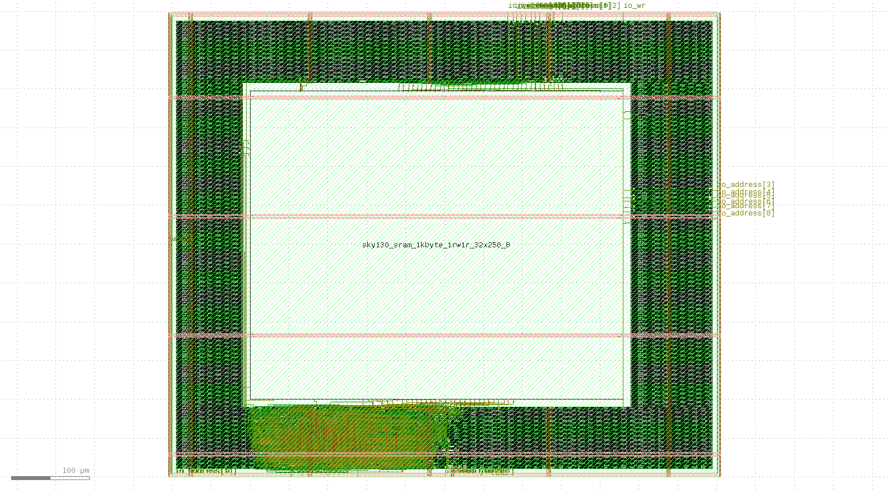

## VGA controller
We made a VGA video controller that is connected to the Wildcat CPU. The video controller is mapped to the memory addresses 0xf0020000 to 0xf002ffff. By writing to these addresses, the CPU is writing directly into a 1 KiB memory. Each byte in the memory corresponds to a character which is displayed on the VGA output.

For VGA timing we use a 200x150 resolution with a 10MHz pixel clock. This is not a VGA standard but rather it is derived from the 800x600 at 40 MHz standard. This would result in a 200x600 resolution. To maintain square pixels, we also combine groups of 4 sequential lines, resulting in a 200x150 resolution.

Each character is 8x8 pixels which results in 200/8 = 25 characters across a line and 150/8 = 18.75 lines. This means that only 25x19=475 characters are visible. This also means that the remaining 549 bytes of the memory module are wasted. The reason we use 1 KiB is because the smallest prebuilt OpenRAM module is 1KiB.

We use both the read/write port and read-only port of the OpenRAM module, since the video controller needs to be able to read characters to show on the screen, while the Wildcat is writing to the memory. Further work could utilize the timing overhead in the VGA standard to write characters, thus only requiring one read/write port.

The VGA controller uses 8 output pins for outputting the video and is designed to work with the Tiny Tapeout VGA Pmod (https://github.com/mole99/tiny-vga). 

The characters displayed are encoded using ASCII, which takes up 7 bits. The 8th bit determines ASCII mode or color mode. When in color mode, the least significant 6 bits encodes an RGB color value.

To determine the size of the video controller, we created a macro. The size of the macro is primarily determined by the size of the OpenRAM macro used (479.78 μm  x 397.5 μm). Adding 1 roughly 100 μm margin on all sides gives us a video controller macro size of 700 μm x 600 μm. As can be seen on the figure above, the video controller ends up fitting inside a little part of this margin.

### Testing
To test the video controller we have made a cocotb test that verifies the timing of the hsync signal. To test the RGB outputs we have synthesised the entire project to FPGA and connected the FPGA board to a VGA monitor.

## Wildcat Caravel Communication

We made a peripheral for communication between the Wildcat CPU and the Caravel management CPU. Both Wildcat and Caravel each have a 32 bit register in our communication peripheral. Each CPU can write to one register, and then the register can be read by the other CPU, like two mailboxes. Communication between the peripheral and Caravel is done using the Wishbone bus. Communication between the peripheral and Wildcat is done using the Wildcat data bus. Caravel reads and writes to the address 0x00500000. Wildcat reads and writes to the address 0xF0030000. 

### Test
The functionality of the Wildcat Caravel Communication is tested with a cocotb test, consisting of an echo program. The test works by having the Caravel management CPU send a value to the Wildcat CPU, which Wildcat writes back after having incremented it by one. Caravel expects this new value and the test fails if a different value is received. 

## RTL verification continuous integration

We made a continuous integration test for RTL verification in the form of an automatic GitHub action. The RTL verification test works by running `cf verify --all` which runs all the cocotb rtl tests that have been made throughout the course.

We encountered two problems with this however:
- The command always returns exit code 0 even when tests fail, so to signal a failure we used `grep “Fail:”` on the output.
- When cocotb tests fail to compile, the error messages are written in a log file and not to standard output. To solve this we used `grep “Error”` on the output and read the log files. 

This requires the GitHub action to run the command `cf verify --all` three times for the three different cases. Further work could look into optimising this redundancy.

## Synthesis to FPGA

Synthesis was done for the Basys3 FPGA board using Vivado. Synthesis required creating a top-level module that ties unused signals to constant values to avoid “unconnected port” errors. In this top level module the Wishbone interface of the CaravelUserProject is controlled by a UartDebug module (https://github.com/t-crest/soc-comm/blob/master/src/main/scala/debug/UartDebug.scala). A ‘w’ character followed by 64 bits written as 16 hexadecimal characters will trigger a write on the wishbone interface, where the most significant 32 bits correspond to the write address and the least significant 32 bits correspond to the write data. Currently only the video output of CaravelUserProject is mapped to the IO of the FPGA. Further work could look at mapping more peripherals (e.g. LEDs or SPI) and a way to read addresses with UartDebug.

## GPIO peripherals

A simple WishboneGpio with 8 GPIO pins was put on the Wishbone bus in order to have something simple working in case the more complicated modules like WildCat fail to work. They are put on wishbone address 0x00000000, but are currently not connected in the project.
